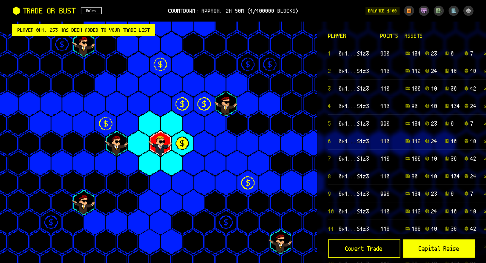
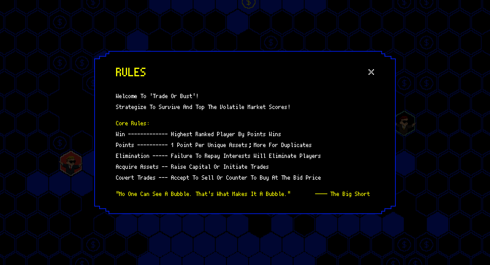
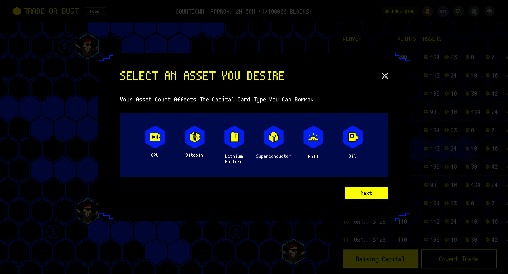
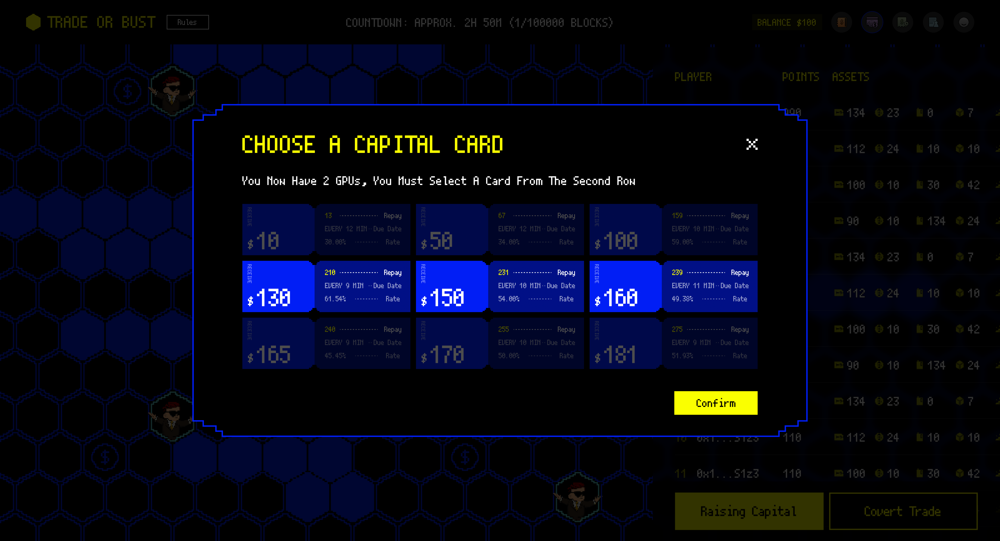
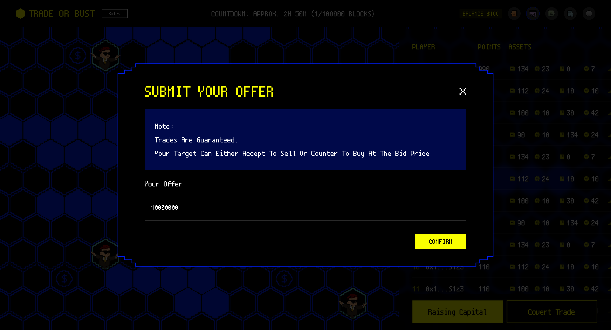

# Trade-Or-Bust

# **Game Introduction**

**Trade or Bust is a fully on-chain economic strategy game where players strategize to survive in a volatile economic market. ✨**

In this dynamic and unpredictable market, players are tasked with crafting personal strategies to continuously accumulate assets within a limited timeframe. Your journey involves securing financing, exploring a rich and varied map, engaging in covert trades with peers, and meeting interest payments to the central bank. Your ultimate goal? To survive the market's randomness and uncertainties, emerging as the triumphant victor in a vibrant economic battleground. 

Dive in, strategize, trade, and may the best player win! 👍



## **Core Rules**



For a deeper dive into the game rules, please check 👉  [Trade or Bust Rules](https://www.notion.so/Trade-or-Bust-Rules-953378b93b8f4d73b586d44e678bd9d8?pvs=21) 

## Core Game Play

### Asset Select

There are 6 different types of assets available for you to choose from. One of the strategies you need to consider is how to ensure sufficient liquidity for your assets. 😆



### Capital Card Choose

Each capital card offers different interest rates. Consider your strategy carefully before making a selection. 🧐



### Covert Trade

Only the two parties involved in the trade know the price information. Make the most of this process by strategizing and bargaining! 🤩



# Tech Stack

## **Technologies Used**

In the project, we have adopted the following technologies:

- MUD Engine: The project leverages the power of the MUD engine to enable seamless multiplayer gameplay and persistent game state management.
- CocosCreator: We have utilized CocosCreator as our frontend development tool to enhance the development efficiency and achieve impressive visual effects.
- Zero-Knowledge Proof for Enhanced Gameplay: In the core game content - forced trading part, we plan to use Zero-Knowledge Proof to encrypt the trading content to increase the fun and challenge of the game.

## Game Logic and Data Storage

To support our game's complexity and functionality, we have implemented nearly 20 tables using MUD's built-in Store feature. These tables serve as containers for storing and managing various aspects of the game logic and data.

So far, the main tables we have created and utilized include: 

- Game, GameState, GameMap, MapItem, IsPlayer, Player, RaiseCooldown, AssetsList, PartnerList, TradeList, IsTrading, PlayerGameResult, UnsolicitedTransaction, PassiveTransaction.
- Additionally, we have utilized some modules provided by MUD to assist in the implementation of our functionalities, such as UniqueEntityModule, KeysInTableModule, and KeysWithValueModule. They have been recognized as convenient and helpful in our development process.

We are confident that these tables, within the current ECS framework, will make our work more flexible and adaptable.

## **APIs for Frontend-Backend Interaction**

The project encompasses over a dozen APIs that facilitate seamless communication between the frontend and backend components. These APIs handle important operations and actions required for the game mechanics and player interactions.

They are

```
joinGame,askStart,move,pickAsset,pickFund,trade,acceptTrade,rejectTrade,finishGame
```

We have implemented these interfaces preliminarily, but in a real environment, the situation may become more complex. In subsequent development, we will incorporate additional logic to handle various unexpected scenarios, such as insufficient tokens.

## **Enhanced Gameplay with Zero-Knowledge Proof**

In the core gameplay content, specifically the mandatory trading aspect, we have planned to incorporate Zero-Knowledge Proof (ZKP) to encrypt transactional content. This addition aims to enhance the game's overall excitement, challenge, and security by introducing cryptographic techniques to ensure privacy and validate player actions.

## **Installation and Setup**

1. Clone the repository: `git clone https://github.com/mirrorworld-universe/trade-or-bust`
2. Prepare MUD dependencies: [Node 17+ and Foundry](https://mud.dev/tutorials/emojimon/getting-started)
3. Navigate to the project directory: `cd trade-or-bust`
4. Install dependencies: `pnpm install`
5. Launch the application: `pnpm run dev`
6. Access the game in your browser at [http://localhost:3000](http://localhost:3000/).